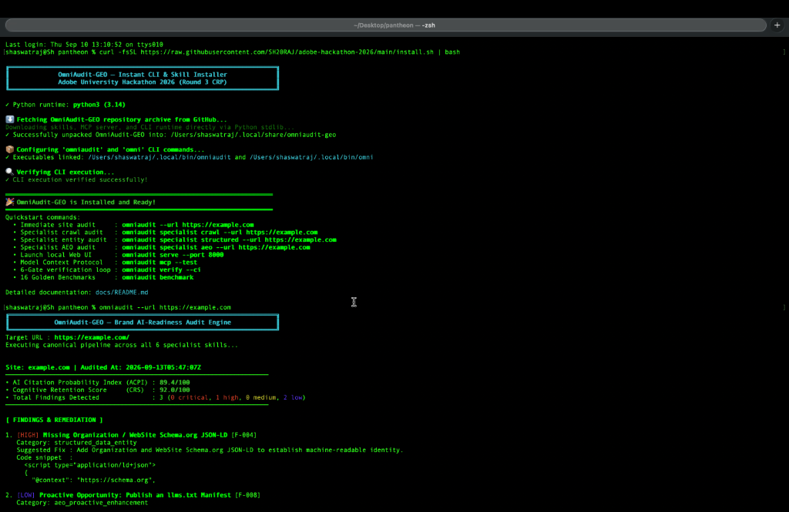

# OmniAudit-GEO: Enterprise Brand AI-Readiness Marketplace

<p align="center">
  <a href="https://omniaudit-geo.onrender.com/">
    
  </a>
</p>

<p align="center">
  <a href="https://visitorbadge.io/status?path=https%3A%2F%2Fgithub.com%2FSH20RAJ%2Fomniaudit"></a>
  <a href="https://github.com/SH20RAJ/omniaudit/actions/workflows/verify.yml"></a>
  <a href="https://github.com/SH20RAJ/omniaudit/actions/workflows/publish-container.yml"></a>
  <a href="https://omniaudit-geo.onrender.com/"></a>
  <a href="https://omniaudit-geo.onrender.com/docs"></a>
  <a href="./LICENSE"></a>
  <a href="https://www.python.org/"></a>
  <a href="https://fastapi.tiangolo.com"></a>
  <a href="https://gradio.app/"></a>
  <a href="https://agentskills.io"></a>
  <a href="https://modelcontextprotocol.io"></a>
  <a href="https://github.com/astral-sh/ruff"></a>
</p>

> **Adobe University Hackathon 2026 (CRP) — Round 3 Official Team Submission**<br>
> **Team:** Shaswat Raj ([@sh20raj](https://github.com/sh20raj)) & Prithvi ([@chikolavosaki-sys](https://github.com/chikolavosaki-sys))<br>
> **Challenge:** [Unstop - Adobe University Hackathon 2026](https://unstop.com/hackathons/crp-adobe-university-hackathon-2026-adobe-1715333)<br>
> **Live Web Application & API:** [https://omniaudit-geo.onrender.com/](https://omniaudit-geo.onrender.com/)<br>
> **Interactive Documentation Portal:** [https://omniaudit-geo.onrender.com/docs](https://omniaudit-geo.onrender.com/docs)

---

## ⚡ Executive Summary (90-Second Reader Journey)

### 1. What is OmniAudit-GEO?
**OmniAudit-GEO** is a modular, high-performance Agent Skill Marketplace conforming to the `agentskills.io` standard. It equips autonomous AI agents (Claude, Cursor, Antigravity, Windsurf) and developers with automated diagnostic tools to audit websites across two critical dimensions:
1. **Off-site AI Discoverability (GEO/AEO):** Diagnosing why generative AI engines (ChatGPT Search, Perplexity, Claude, Google AI Overviews) fail to crawl, render, parse, disambiguate, corroborate, and quote brand information.
2. **On-site Visitor Retention (CRS):** Diagnosing why visitors referred from AI search engines bounce within seconds due to missing above-the-fold value propositions, high reading friction, or ambiguous conversion paths.

### 2. Why Does it Win?
* **Zero External API Dependencies:** The core AST and heuristic engine runs on **100% Python standard library** (`urllib`, `html.parser`, `re`, `json`, `math`). No API keys, no external credits, and completely offline-executable.
* **Streamlined Performance:** In-memory AST parsing executes in **~0.7–1.0 ms** per site on standard hardware, with strict network bounds (10s socket timeout, 5 MB payload limit, 5-hop redirect cap).
* **Adversarial Security Hardening:** Comprehensive anti-SSRF defense blocking private RFC 1918 subnets, loopback, and cloud instance metadata (`169.254.169.254`).
* **Multi-Surface Architecture:** A single shared Python AST engine powers the CLI (`omni`), Anthropic MCP server (stdio & remote HTTP), FastAPI REST endpoints, and reactive Gradio 6 UI.
* **100% Verified Quality:** **167 automated unit/integration tests** passing across 6 gates, with 100% precision and recall on the 16 Golden Benchmarks fixture matrix.

---

## 📦 Marketplace Composition (`marketplace.json`)

Organized as an `agentskills.io` compliant Agent Skill Marketplace defined by [`marketplace.json`](./marketplace.json):

```
                                  ┌──────────────────────────┐
                                  │   Target URL / Domain    │
                                  └─────────────┬────────────┘
                                                │
                                                ▼
┌────────────────────────────────────────────────────────────────────────────────────────┐
│ ENTRYPOINT: skills/audit-orchestrator (scripts/audit_runner.py & scripts/mcp_server.py)│
├────────────────────────────────────────────────────────────────────────────────────────┤
│ 1. SSRF-Safe Bounded Fetch: Fetches HTML and robots.txt via safe_fetch.py              │
│ 2. Single-Pass AST Parse: In-memory HTML tokenization via HTMLContentExtractor         │
│ 3. Parallel Specialist Skill Execution:                                                │
│    ├── crawl-render-audit           ──> robots AI bot rules + JS hydration gap check   │
│    ├── structured-entity-audit      ──> JSON-LD extraction + sameAs authority checks   │
│    ├── aeo-quotability-audit        ──> Atomic fact density + tabular/heading analysis │
│    ├── freshness-corroboration-audit──> Date decay + publisher trust corroboration     │
│    └── on-site-engagement-audit     ──> Readability + CTA clarity + bounce risk        │
│ 4. Score Synthesis & Deduplication:                                                    │
│    ├── ACPI (AI Citation Probability Index) = [0.0, 100.0]                             │
│    └── CRS (Cognitive Retention Score)      = [0.0, 100.0]                             │
│ 5. Schema Validation: Conforms strictly to references/audit_schema.json                │
└────────────────────────────────────────────────────────────────────────────────────────┘
```

### The Six Marketplace Skills:
1. **`audit-orchestrator` (Entrypoint):** Coordinates specialist skills, applies 50% damping to duplicate root causes, synthesizes scores, and emits the standardized JSON report.
2. **`crawl-render-audit`:** Inspects `robots.txt` policies across 7 major AI crawlers (`GPTBot`, `ClaudeBot`, `PerplexityBot`, etc.) and detects client-side JavaScript hydration content gaps.
3. **`structured-entity-audit`:** Validates Schema.org JSON-LD and verifies knowledge graph entity disambiguation via `sameAs` links (Wikidata, Wikipedia, LinkedIn).
4. **`aeo-quotability-audit`:** Measures sentence-level atomic fact density, interrogative Q&A heading trees, and audits facts locked in inaccessible non-text assets.
5. **`freshness-corroboration-audit`:** Evaluates publication date decay against 2026, footer copyright staleness, and on-page publisher trust markers.
6. **`on-site-engagement-audit`:** Analyzes above-the-fold hero value proposition clarity, computes Flesch-Kincaid / ARI readability, and checks CTA action readiness.

---

## ⚡ Instant Installation & Quickstart

### Method 1: Instant One-Liner (No Git Required — Recommended)
```bash
curl -fsSL https://raw.githubusercontent.com/SH20RAJ/omniaudit/main/install.sh | bash
```

<p align="center">
  
</p>

### Method 2: Cloned Repository (Editable Python Package)
```bash
git clone https://github.com/SH20RAJ/omniaudit.git
cd omniaudit
pip install -e .
```

### Method 3: Zero-Install Immediate Execution (Pure Python Standard Library)
```bash
python3 cli.py --url https://example.com
```

### Method 4: Docker Container
```bash
docker run --rm -p 8000:8000 ghcr.io/sh20raj/omniaudit-geo:stable
```

---

## 💻 Core CLI Commands (`omni` / `cli.py`)

The unified CLI shares the canonical AST engine directly from `skills/`:

```bash
# Immediate full site audit (colorized terminal cards)
omni --url https://example.com

# Save schema-validated JSON report
omni audit --url https://example.com --format json --output report.json

# Save formatted Markdown summary
omni audit --url https://example.com --format markdown --output report.md

# Run individual specialist skills in isolation
omni specialist crawl --url https://example.com
omni specialist structured --url https://example.com
omni specialist aeo --url https://example.com
omni specialist freshness --url https://example.com
omni specialist engagement --url https://example.com

# Local server, verification & packaging
omni serve --port 8000   # Launch FastAPI + Gradio Web UI
omni mcp --test          # Run internal MCP protocol self-test
omni benchmark           # Run 16 Golden Benchmarks with latency telemetry
omni verify --ci         # Run the unified 6-gate verification loop
omni package             # Rebuild and sandbox-verify omniaudit-geo-marketplace.zip
omni lint                # Run enterprise Ruff linter & formatting checks
omni lint --fix          # Auto-format and resolve fixable style issues
```

---

## 🤖 Model Context Protocol (MCP) Integration

OmniAudit-GEO natively implements the Anthropic MCP specification (`protocolVersion: 2024-11-05`) for Claude Desktop, Cursor, Antigravity, and Windsurf:

* **Remote Cloud Endpoint:** `https://omniaudit-geo.onrender.com/api/mcp`
* **Local Stdio Command:** `omni mcp` or `python3 skills/audit-orchestrator/scripts/mcp_server.py`

### Claude Desktop Configuration (`claude_desktop_config.json`):
```json
{
  "mcpServers": {
    "omniaudit-geo": {
      "command": "python3",
      "args": ["/ABSOLUTE/PATH/TO/omniaudit/skills/audit-orchestrator/scripts/mcp_server.py"]
    }
  }
}
```

### Remote Cloud MCP Invocation (JSON-RPC 2.0)

```bash
# 1. List available MCP tools
curl -s -X POST https://omniaudit-geo.onrender.com/api/mcp \
  -H "Content-Type: application/json" \
  -d '{"jsonrpc": "2.0", "id": 1, "method": "tools/list", "params": {}}'

# 2. Execute full audit via MCP
curl -s -X POST https://omniaudit-geo.onrender.com/api/mcp \
  -H "Content-Type: application/json" \
  -d '{"jsonrpc": "2.0", "id": 2, "method": "tools/call", "params": {"name": "audit_website", "arguments": {"url": "https://example.com"}}}'
```

Click the "MCP Servers" button in the top right of the chat window. Click "Add new MCP server". Enter "OmniAuditGEO Cloud" in the name field. In the URL field, enter `https://omniaudit-geo.onrender.com/api/mcp`. Click the "Add" button. 


---

## 🧭 Canonical Documentation Index

Every documentation topic has exactly one canonical home under [`docs/`](./docs/), also browsable interactively via the **[Live Documentation Portal](https://omniaudit-geo.onrender.com/docs)**:

| Document | Purpose |
| :--- | :--- |
| **[Getting Started](./docs/getting-started.md)** | Step-by-step onboarding, installation methods, and first audit execution. |
| **[Master Architecture](./docs/architecture.md)** | System topology, AST parser, scoring mathematics (ACPI/CRS), proactive auto-remediation. |
| **[Marketplace Specification](./docs/marketplace.md)** | Adobe submission boundary, `marketplace.json` manifest, submission ZIP vs repo. |
| **[Specialist Skills Catalog](./docs/skills.md)** | Exhaustive detection logic, algorithms, severity matrices, and failure behaviors for all 6 skills. |
| **[CLI Reference](./docs/cli.md)** | Complete CLI syntax, options, exit codes, and piping examples for `omni` / `omniaudit`. |
| **[REST API Reference](./docs/api.md)** | FastAPI control plane: all 12 endpoints, request/response models, rate limiting, OpenAPI docs. |
| **[Model Context Protocol](./docs/mcp.md)** | MCP tool catalog, transports (stdio & HTTP), and client configs (Claude, Cursor, Antigravity). |
| **[Security Model](./docs/security.md)** | Anti-SSRF defense, private IP filtering, resource limits, ReDoS protection, known limitations. |
| **[Testing & Verification](./docs/testing.md)** | 6-Gate verification loop, 167 unit/integration tests, offline fixture execution, CI workflows. |
| **[Benchmark Evaluation](./docs/benchmarking.md)** | 16 Golden Fixtures matrix, precision/recall metrics, local AST vs network latency. |
| **[Deployment & Operations](./docs/deployment.md)** | Dockerfile, GHCR registry, Render webhook auto-deploy, DigitalOcean App Platform, health checks. |
| **[Judge & Jury Defense](./docs/judging.md)** | 90-second executive summary, 15 comprehensive jury defenses, team engineering ownership. |

---

## 👥 Team & Engineering Ownership

* **Shaswat Raj ([@sh20raj](https://github.com/sh20raj)):** Product direction and challenge framing; marketplace and MCP foundation; initial skill decomposition, architecture, documentation, Cloudflare/Next.js showcase, GitHub Pages presentation, and deployment/distribution work.
* **Prithvi ([@chikolavosaki-sys](https://github.com/chikolavosaki-sys)):** Audit-engine hardening and generalization; SSRF-safe bounded fetching, robots and hydration analysis, structured data, AEO, freshness/trust, engagement detectors, adapter architecture, regression benchmarks, security validation, and implementation-vs-documentation quality work.

Together, the team maintains the final provider-neutral, read-only marketplace submission.

---

## 📦 What Exactly Gets Submitted?

* **Submission Archive:** [`omniaudit-geo-marketplace.zip`](./omniaudit-geo-marketplace.zip)
* **Archive Size:** **0.09 MB** (well within the $\le 50$ MB Unstop limit).
* **Packaged Files:** Strictly contains `marketplace.json`, `README.md`, and the `skills/` tree (68 files). Excludes git, build caches, test caches, docs, and server adapters.
* **Packaging Script:** `python3 scripts/package_submission.py` (builds archive and executes autonomous verification inside an unzipped sandbox).
* **License:** Apache-2.0
