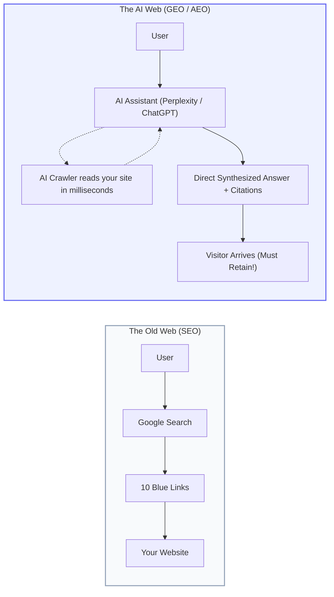
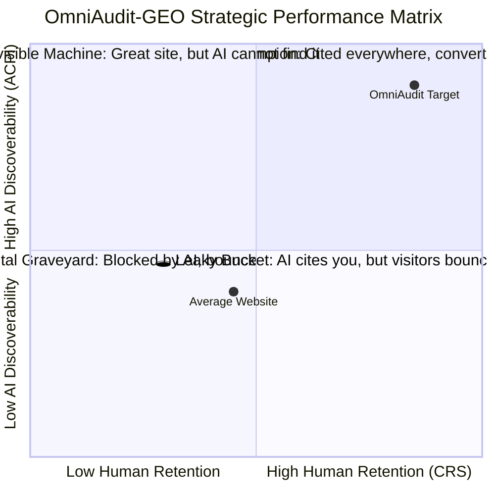
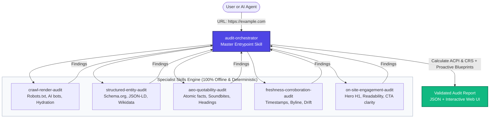

# 📘 OmniAudit-GEO — The Complete Beginner's Guide

> **Welcome!** If you have never heard of **GEO (Generative Engine Optimization)**, **AEO (Answer Engine Optimization)**, or **Schema.org Knowledge Graphs**, this guide was written specifically for you.
> 
> By the end of this 10-minute read, you will understand exactly how artificial intelligence search engines view the web, why websites lose traffic to AI, and how **OmniAudit-GEO** helps brands get discovered, cited, and loved by both machines and humans.

---

## 🌟 1. The Big Picture: What is OmniAudit-GEO?

### The Internet Has Changed
For the past 25 years, search meant one thing:
1. A human typed keywords into Google.
2. Google displayed a list of 10 blue links.
3. The human clicked a link to read the website.

Today, **hundreds of millions of people** ask questions directly to AI assistants: **ChatGPT, Perplexity, Claude, and Google Gemini / AI Overviews**.



### The New Problem
If an AI assistant cannot:
- **Crawl** your website (because your server or `robots.txt` blocks it),
- **Read** your content (because your text is trapped inside JavaScript code that hasn't loaded yet),
- **Understand** who you are (because you lack Schema.org structured data), or
- **Quote** clear facts (because your writing is vague marketing fluff),

Then **your brand is completely invisible to AI**, and the AI will recommend your competitor instead.

Furthermore, if a human *does* click an AI citation and arrives on your site, but finds a confusing headline, walls of text, and no clear button to take action, **they immediately bounce back to ChatGPT**.

### The Solution: OmniAudit-GEO
**OmniAudit-GEO is the "Google PageSpeed Insights" of the Generative AI Era.**

Given any website URL, OmniAudit-GEO automatically audits it across two complementary axes:
1. **Off-Site AI Discoverability (GEO/AEO):** Can AI crawlers find, read, understand, and cite your brand?
2. **On-Site Visitor Retention (CRS):** When visitors arrive from AI referrals, do they stay and convert?

---

## 📊 2. The Two Core Scores Explained Simply

OmniAudit-GEO gives every website two scores from **0.0 to 100.0**:



### Axis 1: ACPI — AI Citation Probability Index (0–100)
> **Question:** *"How likely is ChatGPT or Perplexity to find, trust, and quote your website?"*

ACPI evaluates 5 machine criteria:
* **Crawlability (30%):** Does your `robots.txt` let AI crawlers in (`GPTBot`, `ClaudeBot`, `PerplexityBot`), or are they locked out?
* **Renderability (15%):** Is your text in plain, readable HTML, or is it trapped inside an empty Single-Page Application (SPA) shell?
* **Entity Clarity (20%):** Do you have machine-readable Schema.org JSON-LD tags defining your company, products, and Wikidata identifiers?
* **Quotability (20%):** Do you have clear, atomic definitions (e.g. *"Acme is a cloud database that..."*) that an AI can easily quote as a soundbite?
* **Trust & Freshness (15%):** Are your publication dates recent, is your copyright updated, and is your author verified?

---

### Axis 2: CRS — Cognitive Retention Score (0–100)
> **Question:** *"When a human arrives from an AI search, do they understand what you do and take action, or do they bounce?"*

CRS evaluates 4 human retention criteria:
* **Orientation (35%):** In the top 600 pixels of your page (the Hero section), do you have a clear H1 headline explaining your core value proposition within 5 seconds?
* **Intent Continuity (25%):** Does your page answer the specific question the visitor came for, without annoying popups or immediate paywalls?
* **Readability (20%):** Is your writing easy to understand (grade level 8–10) or filled with complex academic jargon?
* **Actionability (20%):** Is there a clear, high-contrast Call-to-Action button (e.g. *"Start Free Trial"* or *"Book a Demo"*) instead of vague links like *"Click Here"*?

---

## 🏗️ 3. How It Works Under the Hood: The 6 Specialist Skills

OmniAudit-GEO is built according to the **`agentskills.io` open standard**. It breaks down the complex auditing process into **6 focused, independent skills**:



### Meet the Specialists:
1. 🎯 **`audit-orchestrator` (The Conductor):** The sole entrypoint. It receives the audit request, validates URL safety against SSRF attacks, dispatches work to the 5 specialists, merges all findings, computes the scores, and produces the final report.
2. 🕷️ **`crawl-render-audit` (The Gatekeeper):** Parses your `robots.txt` file specifically looking for AI user-agents (`GPTBot`, `ClaudeBot`, `PerplexityBot`, `CCBot`). It also inspects whether your HTML contains actual text or just empty `<div id="root"></div>` tags.
3. 🏷️ **`structured-entity-audit` (The Knowledge Graph Architect):** Extracts embedded `<script type="application/ld+json">` tags, checks if the syntax is valid JSON, and verifies that your Organization has official `sameAs` links pointing to Wikidata, Wikipedia, or LinkedIn.
4. 📝 **`aeo-quotability-audit` (The Journalist):** Scans for concise definition sentences, calculates fact density per 100 words, verifies that your headings follow a logical hierarchy (`H1` ➔ `H2` ➔ `H3`), and ensures facts aren't trapped inside image graphics without `alt` text.
5. ⏱️ **`freshness-corroboration-audit` (The Fact Checker):** Inspects `dateModified` timestamps, checks if your footer copyright date is current or 4 years old, and prevents brand disambiguation confusion.
6. 🧭 **`on-site-engagement-audit` (The UX Designer):** Analyzes above-the-fold content, computes the Flesch Reading Ease score, evaluates CTA button visibility, and flags layout friction.

---

## ⚡ 4. The Engineering Superpower: Zero External APIs ($0.00 Cost)

Most modern AI developer tools make expensive calls to OpenAI (`gpt-4o`) or Anthropic (`claude-3-5-sonnet`) behind the scenes. This causes three major problems:
1. 💸 **High Costs:** Auditing 1,000 pages would cost hundreds of dollars in API bills.
2. 🎲 **Non-Deterministic (Hallucinations):** The same website might get a score of 85 today and 72 tomorrow because LLM outputs fluctuate.
3. 🐢 **Slow Latency:** Waiting for cloud LLM APIs takes 15 to 30 seconds per page.

### The OmniAudit-GEO Advantage:
OmniAudit-GEO uses **100% Python Standard Library AST and regex state machines**:
* **Cost:** **$0.00** per audit. Zero tokens used.
* **Speed:** Audits run in **0.4 to 2.0 seconds** on live websites, and in **0.4 milliseconds** on local HTML files.
* **Reproducibility:** If you run the audit 100 times, the mathematical ACPI and CRS scores will be identical every single time.
* **Privacy & Security:** No website data or proprietary code is ever sent to third-party cloud servers.

---

## 🚀 5. How to Run OmniAudit-GEO in 60 Seconds

You can use OmniAudit-GEO however you like — in your browser, via terminal, or inside your IDE:

### Option A: The Live Web App (No Installation Required!)
Open your browser and visit the production deployment:
👉 **[https://omniaudit-geo.onrender.com](https://omniaudit-geo.onrender.com)**

Type in any website URL (e.g. `https://example.com`) and click **"Run Audit"**. You will get an instant visual dashboard with interactive dials, finding cards, and copy-paste code fixes.

---

### Option B: The Terminal One-Liner
If you have Python 3.10+ installed on your Mac, Linux, or Windows machine:

```bash
# Clone the repository
git clone https://github.com/SH20RAJ/omniaudit.git
cd omniaudit

# Run an instant audit on any website
python3 cli.py --url "https://example.com"
```

You will see rich colored terminal output detailing your ACPI score, CRS score, and findings.

---

### Option C: The Interactive Terminal TUI
Want a visual dashboard right inside your terminal? Run:

```bash
python3 cli.py
```
This launches a keyboard-driven terminal dashboard where you can enter URLs, view severity breakdowns, inspect code fixes, and run automated benchmarks.

---

### Option D: Developer REST API
Want to audit websites programmatically from your own apps? Start the built-in server:

```bash
# Start the FastAPI server
python3 omniaudit-geo/main.py
```

Then send a standard HTTP `POST` request:

```bash
curl -X POST "http://localhost:8000/api/v1/audit" \
     -H "Content-Type: application/json" \
     -d '{"url": "https://example.com"}'
```

---

### Option E: Model Context Protocol (MCP) for AI Assistants
OmniAudit-GEO is an official **Model Context Protocol (MCP)** server. You can plug it into **Claude Desktop**, **Cursor IDE**, or **Antigravity AI**, allowing your AI assistant to audit websites autonomously using the tools:
* `audit_website`
* `inspect_robots_and_rendering`
* `inspect_structured_data`
* `inspect_aeo_quotability`
* `inspect_freshness_trust`
* `inspect_on_site_retention`

---

## 📖 6. Understanding an Audit Finding

Every issue discovered by OmniAudit-GEO has a structured, predictable format:

```json
{
  "id": "F-001-GPTBot",
  "title": "GPTBot Blocked by robots.txt",
  "severity": "high",
  "category": "crawlability_robots",
  "evidence": "{\"crawler\": \"GPTBot\", \"matched_directive\": \"Disallow: /\", \"status\": \"BLOCKED\"}",
  "suggested_action": {
    "summary": "Allow GPTBot to access / so OpenAI models can retrieve your facts.",
    "priority": "high",
    "implementation_code": "User-agent: GPTBot\nAllow: /\nDisallow: /private/"
  }
}
```

### The 4 Severity Levels:
* 🔴 **Critical:** The site is completely invisible to machines or humans (e.g., DNS failure, server crash, or `X-Robots-Tag: noindex`).
* 🟠 **High:** Major barrier to AI citation or human conversion (e.g., blocking `GPTBot`/`ClaudeBot`, missing Schema.org `Organization` identity, or total hydration gap).
* 🟡 **Medium:** Degrades quotation likelihood or causes retention friction (e.g., missing Wikidata `sameAs` link, stale copyright date, or reading level grade > 14).
* 🔵 **Low / Proactive:** Semantic polish and future-proofing (e.g., publishing an `llms.txt` file, or encasing definitions in `<figure>` callouts).

---

## 🛠️ 7. Three Common Fixes You Can Apply Today

### 1. How to Let AI Crawlers In (`robots.txt`)
If OmniAudit-GEO reports finding `F-001`, your website is telling AI bots to stay away.
* **Fix:** Open your `robots.txt` file and add explicit permissions for search and citation crawlers:
  ```txt
  # Allow search and retrieval bots to cite your brand
  User-agent: GPTBot
  Allow: /

  User-agent: ClaudeBot
  Allow: /

  User-agent: PerplexityBot
  Allow: /
  ```

---

### 2. How to Claim Your Identity with Schema.org JSON-LD
If OmniAudit-GEO reports finding `F-004` or `F-005`, AI models cannot distinguish your brand from other entities with similar names.
* **Fix:** Add this code inside the `<head>` tag of your website:
  ```html
  <script type="application/ld+json">
  {
    "@context": "https://schema.org",
    "@type": "Organization",
    "name": "Your Brand Name",
    "url": "https://yourwebsite.com",
    "logo": "https://yourwebsite.com/logo.png",
    "sameAs": [
      "https://www.wikidata.org/wiki/QXXXXX",
      "https://en.wikipedia.org/wiki/Your_Brand",
      "https://www.linkedin.com/company/yourbrand",
      "https://twitter.com/yourbrand"
    ]
  }
  </script>
  ```

---

### 3. How to Boost Your "Quotability" (Atomic Soundbites)
If OmniAudit-GEO reports finding `F-015`, your writing is too abstract for an AI to quote in a 1-sentence answer.
* **Fix:** Start your key sections with an **inverted pyramid definition** sentence:
  * ❌ *Vague:* "We empower holistic paradigm shifts across frictionless digital workflows."
  * ✅ *Quotable:* "Acme is a cloud-based CRM platform designed to automate invoice reconciliation for accounting teams."

---

## 📚 8. Glossary of Terms for Beginners

| Term | What It Means | Why It Matters |
|---|---|---|
| **AEO** | *Answer Engine Optimization* | The practice of optimizing content to be cited directly in AI conversational answers (Perplexity, ChatGPT) rather than traditional search results. |
| **GEO** | *Generative Engine Optimization* | Ensuring brand facts, products, and value propositions are trained or retrieved reliably by generative AI models. |
| **ACPI** | *AI Citation Probability Index* | OmniAudit-GEO's proprietary 0–100 score measuring machine discoverability and quotability. |
| **CRS** | *Cognitive Retention Score* | OmniAudit-GEO's proprietary 0–100 score measuring human comprehension and retention upon arrival. |
| **JSON-LD** | *JavaScript Object Notation for Linked Data* | A standardized format for embedding machine-readable semantic facts into a web page. |
| **`sameAs`** | *Schema.org Entity Disambiguation Property* | A URL pointer linking your brand to authoritative global knowledge graphs (like Wikidata or Wikipedia). |
| **`llms.txt`** | *LLM Context Manifest Standard* | A proposed web standard (like `robots.txt`) that provides a clean markdown summary of your site specifically formatted for LLM context windows. |
| **Hydration Gap** | *Client-Side JavaScript Rendering Delay* | When a website sends an empty HTML page to a crawler because the content requires running heavy JavaScript code in the browser first. |
| **SSRF** | *Server-Side Request Forgery* | A security vulnerability where a server is tricked into requesting internal network addresses. OmniAudit-GEO includes built-in anti-SSRF defenses. |

---

## 🏁 9. Summary & Next Steps

* **Explore the Codebase:**
  * Core Orchestrator: [`skills/audit-orchestrator/scripts/audit_runner.py`](file:///Users/shaswatraj/Desktop/adobe-hackathon-2026/skills/audit-orchestrator/scripts/audit_runner.py)
  * Scoring Math & Invariants: [`skills/audit-orchestrator/scripts/scoring.py`](file:///Users/shaswatraj/Desktop/adobe-hackathon-2026/skills/audit-orchestrator/scripts/scoring.py)
  * Architecture Deep Dive: [`docs/architecture.md`](file:///Users/shaswatraj/Desktop/adobe-hackathon-2026/docs/architecture.md)
  * Jury Pitch & Defense: [`pitch.md`](file:///Users/shaswatraj/Desktop/adobe-hackathon-2026/pitch.md)
* **Try Auditing a Website:**
  ```bash
  python3 cli.py --url "https://yourdomain.com"
  ```

*Congratulations! You now understand the fundamentals of Generative Engine Optimization (GEO) and how OmniAudit-GEO powers the future of AI-ready websites.*
