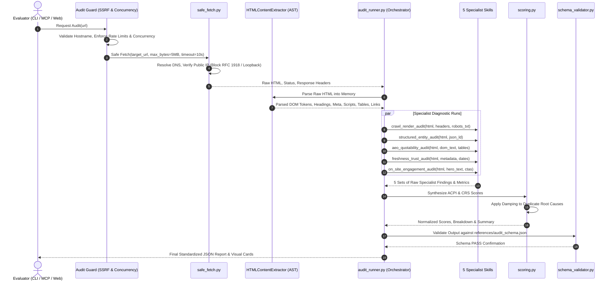

# Master System Architecture & Technical Design: OmniAudit-GEO

## 1. Architectural Philosophy & Layered Separation

OmniAudit-GEO is an autonomous website diagnostic engine built to evaluate brand discoverability in generative AI engines (**GEO/AEO**) and on-site visitor retention (**CRS**).

To guarantee stability, audit reproducibility, and compliance with the `agentskills.io` standard, the system strictly separates four architectural tiers:

```
┌─────────────────────────────────────────────────────────────────────────────────────────────┐
│ 1. PRESENTATION & CONSUMPTION LAYER                                                         │
│    • Unified CLI (`cli.py`, `omni`)         • Gradio 6 Reactive UI (`gradio_ui.py`)         │
│    • Anthropic MCP Clients (Claude/Cursor)  • RESTful API Clients (`GET /api/audit`)       │
├─────────────────────────────────────────────────────────────────────────────────────────────┤
│ 2. ADAPTER & PROTOCOL LAYER                                                                 │
│    • FastAPI Web Control Plane (`main.py`)  • MCP JSON-RPC 2.0 Server (`mcp_server.py`)     │
│    • SSRF & Rate Guard (`audit_guard.py`)   • Schema Validator (`schema_validator.py`)     │
├─────────────────────────────────────────────────────────────────────────────────────────────┤
│ 3. CANONICAL AUDIT ENGINE (`skills/`)                                                       │
│    • Master Orchestrator (`skills/audit-orchestrator/scripts/audit_runner.py`)             │
│    • Crawl & Hydration Inspector (`skills/crawl-render-audit/scripts/crawl_inspector.py`)   │
│    • Schema & Entity Disambiguator (`skills/structured-entity-audit/scripts/`)              │
│    • AEO Quotability Scorer (`skills/aeo-quotability-audit/scripts/quotability_scorer.py`)  │
│    • Freshness & Trust Corroborator (`skills/freshness-corroboration-audit/scripts/`)       │
│    • On-Site Retention Evaluator (`skills/on-site-engagement-audit/scripts/`)               │
├─────────────────────────────────────────────────────────────────────────────────────────────┤
│ 4. SHARED NETWORK & AST INFRASTRUCTURE                                                      │
│    • SSRF-Safe Bounded Fetcher (`skills/crawl-render-audit/scripts/safe_fetch.py`)          │
│    • Pure Python Standard Library AST / DOM Parser (`HTMLContentExtractor`)                 │
│    • Bounded Numerical Scoring Engine (`skills/audit-orchestrator/scripts/scoring.py`)     │
└─────────────────────────────────────────────────────────────────────────────────────────────┘
```

### Architectural Invariants
1. **Core Engine vs. Adapters:** The core diagnostic logic lives strictly inside `skills/**/scripts/`. The CLI (`cli.py`), Web UI (`omniaudit-geo/gradio_ui.py`), and FastAPI routes (`omniaudit-geo/main.py`) are pure adapters. They import and invoke the core engine directly with **zero duplicated logic**.
2. **Standard Library Priority:** The core AST and scoring pipeline has **zero external package dependencies**. It executes offline using Python's built-in `urllib`, `html.parser`, `re`, `json`, and `math`.
3. **Strict Read-Only Execution:** All network communication is restricted to HTTP `GET` and `HEAD`. The engine never issues mutating requests (`POST`, `PUT`, `DELETE`).

---

## 2. End-to-End Audit Pipeline Dataflow

Every audit execution follows a deterministic, 6-stage lifecycle:



---

## 3. Mathematical Scoring Engine

OmniAudit-GEO evaluates websites across two independent mathematical indices. Both scores are continuous floats in $[0.0, 100.0]$:

### 3.1 AI Citation Probability Index (ACPI, 0–100)
The **ACPI** measures the probability that an LLM agent (ChatGPT Search, Perplexity, Claude, Google AI Overviews) can crawl, render, parse, and cite content from the target domain:

$$\text{ACPI} = 0.30 \cdot C_{\text{crawl}} + 0.15 \cdot R_{\text{render}} + 0.20 \cdot E_{\text{entity}} + 0.20 \cdot Q_{\text{quotability}} + 0.15 \cdot T_{\text{freshness}}$$

| Component | Weight | Diagnostic Heuristic |
| :--- | :---: | :--- |
| **$C_{\text{crawl}}$** (Crawlability) | **30%** | `robots.txt` AI crawler permissions (`GPTBot`, `ClaudeBot`, `PerplexityBot`), `X-Robots-Tag`, canonical headers. |
| **$R_{\text{render}}$** (Renderability) | **15%** | Ratio of static HTML content to client-rendered JavaScript hydration dependencies (SPA detection). |
| **$E_{\text{entity}}$** (Entity Clarity) | **20%** | Schema.org JSON-LD validity, Schema types (`Organization`, `Product`, `FAQPage`), and authoritative `sameAs` entity links. |
| **$Q_{\text{quotability}}$** (Quotability) | **20%** | Sentence-level atomic fact density, interrogative Q&A headings, table accessibility vs. facts locked in non-text images. |
| **$T_{\text{freshness}}$** (Freshness & Trust)| **15%** | Temporal decay of publication dates, author bylines, and on-page corroboration citations. |

### 3.2 Cognitive Retention Score (CRS, 0–100)
The **CRS** measures the cognitive continuity and conversion orientation of visitors arriving from AI search referrals:

$$\text{CRS} = 0.35 \cdot O_{\text{orientation}} + 0.25 \cdot I_{\text{intent}} + 0.20 \cdot R_{\text{readability}} + 0.20 \cdot A_{\text{actionability}}$$

| Component | Weight | Diagnostic Heuristic |
| :--- | :---: | :--- |
| **$O_{\text{orientation}}$** (Orientation) | **35%** | Above-the-fold hero section value proposition clarity and concise H1 headline presence. |
| **$I_{\text{intent}}$** (Intent Continuity) | **25%** | Contextual alignment between referral concepts, taxonomy structure, and absence of hard bounce walls. |
| **$R_{\text{readability}}$** (Readability) | **20%** | Bounded Flesch-Kincaid Reading Ease and Automated Readability Index (ARI) grading. |
| **$A_{\text{actionability}}$** (Actionability) | **20%** | Specificity and accessibility of call-to-action (CTA) paths, forms, and primary interaction triggers. |

### 3.3 Score Invariants & Deduplication Damping
1. **Bounded Score Range:** $\text{ACPI} \in [5.0, 100.0]$ and $\text{CRS} \in [10.0, 100.0]$.
2. **Root-Cause Deduplication:** When multiple findings stem from the same root defect (e.g. an empty React SPA shell causes both hydration gap and low text density), subsequent penalties apply a 50% damping factor to prevent cascading double-penalties.
3. **Proactive Fix Invariance:** Proactive recommendations (such as suggested `FAQPage` schema or `llms.txt`) carry strictly zero negative score deductions.

---

## 4. Proactive Auto-Remediation Engine

Unlike conventional linters that only report errors, OmniAudit-GEO dynamically generates production-ready remediation assets:

1. **Synthesized Schema.org JSON-LD:**
   - Extracts the site's brand name, meta description, and social anchors to construct valid, ready-to-paste `Organization` or `Product` JSON-LD graphs.
2. **AI-Optimized `robots.txt` Scaffold:**
   - Generates a balanced `robots.txt` that explicitly grants access to ethical AI search crawlers while protecting internal administrative endpoints.
3. **`llms.txt` Knowledge Manifest:**
   - Compiles a standardized Markdown manifest summarizing core products, docs, and contact info for LLM search indexing.

---

## 5. Security & Threat Modeling Summary

* **SSRF Defense:** `safe_fetch.py` validates DNS resolutions to block loopback (`127.0.0.0/8`), private subnets (`10.0.0.0/8`, `172.16.0.0/12`, `192.168.0.0/16`), cloud metadata (`169.254.169.254`), and IPv6 equivalents before opening sockets.
* **Resource Bounds:** HTTP fetches are capped at **5 MB**, timeouts are enforced at **10 seconds**, and redirect chains are limited to a maximum of **5 hops**.
* **ReDoS Protection:** All regular expressions are anchored and avoid nested polynomial quantifiers.
* For full details, see the dedicated **[Security Model](security.md)**.

---

## 6. Brand Assets & Visual Identity

The project enforces a single source-of-truth asset architecture for logos, favicons, and social cards:

* **Canonical Master Logo (`omniaudit-geo/public/brand/logo.png`):** High-resolution transparent RGBA PNG representing the official brand lockup.
* **Derived Brand Mark (`omniaudit-geo/public/brand/logo-mark.png`):** Extracted square icon mark optimized for favicons and app icons without micro-text distortion.
* **OpenGraph Banner (`omniaudit-geo/public/brand/og-image.png`):** 1200×630 landscape composition for social previews, search cards, and README badges.
* **Asset Pipeline (`scripts/generate_assets.py`):** Programmatically derives all square resolutions (`favicon-16x16.png`, `favicon-32x32.png`, `favicon-48x48.png`, `apple-touch-icon.png`, `icon-192.png`, `icon-512.png`, and multi-resolution `favicon.ico`) directly from `logo.png`.

